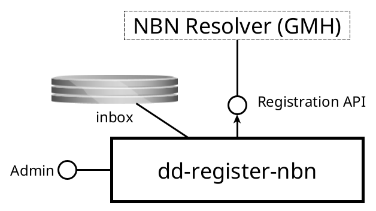

dd-register-nbn
===============

Registers NBN with the NBN Resolver

Purpose
-------
This service takes requests for registration of NBN identifiers from an inbox and executes them.

Interfaces
----------

{width="70%"}

### Provided interfaces

#### Inbox

* _Protocol type_: Shared filesystem
* _Internal or external_: **internal**
* _Purpose_: to receive [Registration Tokens](#registration-tokens)

#### Admin console

* _Protocol type_: HTTP
* _Internal or external_: **internal**
* _Purpose_: application monitoring and management

### Consumed interfaces

#### NBN registration API

* _Protocol type_: HTTP
* _Internal or external_: **external**
* _Purpose_: register NBNs with the NBN Resolver

Processing
----------

The service monitors an inbox for new registration tokens and registers the NBN for each one encountered. 

### Registration Tokens

A Registration Token is a simple properties file with two fields `nbn` and `location`, e.g.,

```properties
nbn=urn:nbn:nl:ui:13-26febff0-4fd4-4ee7-8a96-b0703b96f812
location=https://example.dans.knaw.nl/ui/13-26febff0-4fd4
```

